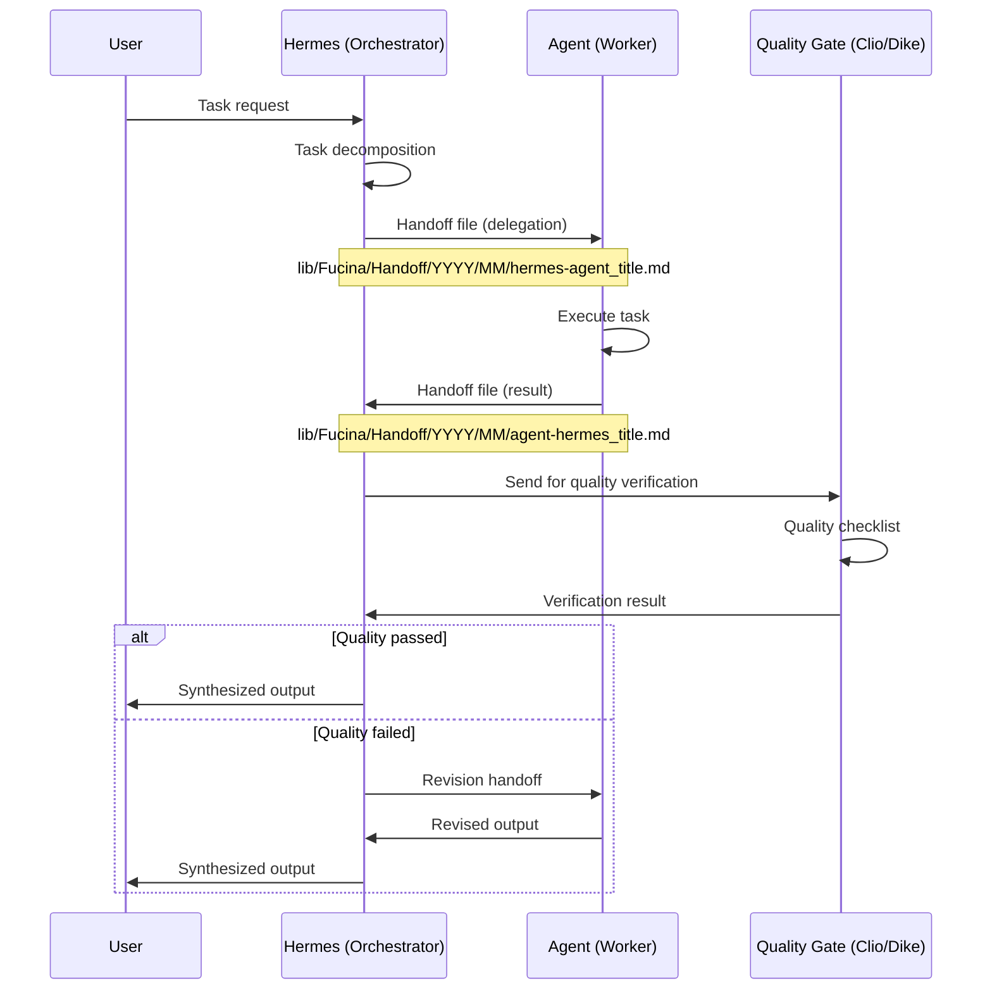
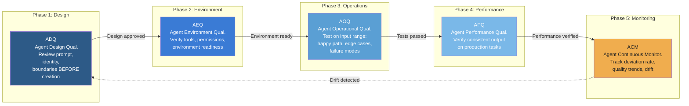
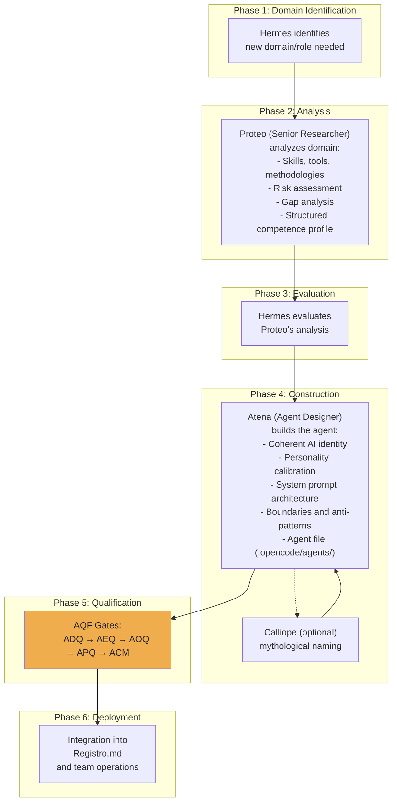

# Team Olimpo: Un Agent Qualification Framework per Sistemi Multi-Agente Pronti per la Produzione

## 1. Abstract

La rapida proliferazione dei sistemi multi-agente (MAS) ha messo in luce una lacuna critica: sebbene esistano numerosi framework per costruire team di agenti, manca una metodologia sistematica per certificare che i singoli agenti operino in modo affidabile, coerente e verificabile nel tempo. Questo articolo presenta **Team Olimpo**, un sistema multi-agente produttivo operativo da febbraio 2026, e il suo contributo principale: **l'Agent Qualification Framework (AQF)**, un ciclo di vita per l'assicurazione qualità in cinque fasi, ispirato agli standard di validazione farmaceutica (IQ/OQ/PQ/CPV) e al framework Computer Software Assurance (CSA) della FDA. A differenza degli approcci MAS esistenti, che trattano gli agenti come unità computazionali effimere, Team Olimpo introduce: un sistema di comunicazione basato su file (handoff) che fornisce tracciabilità completa; una pipeline sistematica per la creazione di agenti (Agent Factory Pipeline); e un adattamento multi-agente del pattern LLM Wiki per la persistenza della conoscenza tra sessioni diverse. Il sistema è composto da 13 agenti specializzati orchestrati da un orchestratore puro (Hermes) che non esegue mai direttamente compiti, operando su tre modelli LLM distinti (big-pickle, Grok-4.3 e Claude Sonnet). In tre mesi di operatività continua, Team Olimpo ha completato oltre 64 handoff documentati, dimostrato una riduzione della latenza del 50-90% su compiti parallelizzabili e raggiunto un ROI misurato di 6,7x sulla capitalizzazione della conoscenza attraverso il layer wiki. L'AQF rappresenta, a nostra conoscenza, il primo framework documentato per la qualificazione strutturata di agenti nella letteratura MAS.

**Keywords:** sistemi multi-agente, agent qualification framework, LLM wiki, agent factory, quality assurance, orchestrator-workers, persistenza della conoscenza

---

## 2. Introduzione

Il biennio 2025-2026 ha assistito a un'esplosione di framework e strumenti per sistemi multi-agente (MAS). Progetti come AutoGPT [1], CrewAI [2], LangGraph [3], OpenAI Agents SDK [4] e AutoGen [5] hanno dimostrato la potenza del coordinamento di più agenti basati su LLM per affrontare compiti complessi. Tuttavia, una domanda fondamentale rimane senza risposta: **come possiamo certificare che un agente svolga in modo coerente la funzione per cui è stato progettato?**

La pratica corrente nel settore rivela quattro sfide persistenti:

1. **Affidabilità (Reliability)**: non esiste una metodologia standard per validare che l'output di un agente soddisfi soglie di qualità prima di essere utilizzato in produzione. Il comportamento degli agenti rimane probabilistico, e "funziona sul mio caso di test" rappresenta lo standard di validazione prevalente.

2. **Tracciabilità (Traceability)**: nella maggior parte dei framework MAS, la comunicazione tra agenti avviene in memoria o attraverso code di messaggi effimere. Quando un compito fallisce, ricostruire la catena di decisioni e azioni che hanno portato al fallimento richiede di ri-eseguire l'intero processo — se esistono log.

3. **Persistenza della Conoscenza (Knowledge Persistence)**: gli agenti operano all'interno di finestre di contesto legate alla sessione. La conoscenza acquisita in una sessione viene persa al termine, costringendo a ricerche ridondanti e ripetuta ricostruzione del contesto. Il pattern LLM Wiki proposto da Karpathy [6] affronta questo problema per sistemi a singolo agente, ma la sua estensione a contesti multi-agente rimane inesplorata nella letteratura pubblicata.

4. **Creazione Sistematica di Agenti (Systematic Agent Creation)**: creare un nuovo agente specializzato rimane un processo artigianale di prompt engineering manuale e calibrazione per tentativi. Non esiste una pipeline documentata per industrializzare la creazione di agenti con gate di qualità integrati.

**Contributi.** Questo articolo presenta l'architettura, la metodologia e i risultati operativi di Team Olimpo, un MAS produttivo che affronta queste sfide. I nostri contributi specifici sono:

1. **AQF (Agent Qualification Framework)**: un ciclo di qualificazione in cinque fasi (ADQ → AEQ → AOQ → APQ → ACM) adattato dagli standard di validazione farmaceutica, che fornisce una certificazione strutturata dell'affidabilità degli agenti con un livello di assurance proporzionale al rischio operativo.

2. **Sistema di Handoff basato su File**: un protocollo di comunicazione asincrono tra agenti basato su file, che produce una traccia di audit completa e versionabile di ogni operazione, consentendo il crash recovery e l'isolamento del contesto.

3. **Agent Factory Pipeline**: un processo sistematico a ruoli separati (Domain Analysis → Agent Design → Qualification → Deployment) per creare nuovi agenti con gate di qualità integrati.

4. **LLM Wiki Multi-Agente**: un adattamento del pattern wiki a singolo agente di Karpathy a contesti multi-agente, con contributi multi-autore, verifica incrociata tra agenti e linting periodico.

5. **Orchestrazione Multi-Modello**: integrazione nativa di tre modelli LLM distinti su 13 agenti, con routing basato sul compito anziché su assegnazione uniforme del modello.

L'articolo è organizzato come segue. La Sezione 3 descrive l'architettura generale del sistema. La Sezione 4 dettaglia il protocollo di comunicazione handoff. La Sezione 5, contributo centrale, presenta l'AQF in profondità. Le Sezioni 6, 7 e 8 trattano rispettivamente l'Agent Factory Pipeline, la Persistenza della Conoscenza e l'Orchestrazione Multi-Modello. La Sezione 9 descrive il sistema di assicurazione qualità, la Sezione 10 presenta i risultati operativi, la Sezione 11 esamina i lavori correlati e la Sezione 12 conclude con le direzioni future.

---

## 3. Architettura del Sistema

Team Olimpo segue uno schema architetturale rigoroso di tipo **orchestrator-workers**. Al centro si trova **Hermes**, un agente orchestratore puro la cui unica funzione è decomporre i compiti in arrivo, delegarli all'agente specializzato più adatto e sintetizzare i risultati. È fondamentale che Hermes non esegua mai compiti direttamente — questa separazione tra orchestrazione ed esecuzione è un principio architetturale fondante.

### 3.1 Diagramma Architetturale

```mermaid
flowchart TB
    User[("User")] -->|"request"| Hermes
    
    subgraph "Orchestration Layer"
        Hermes["Hermes
        (Orchestrator)
        Model: big-pickle"]
    end
    
    subgraph "Research & Analysis"
        Proteo["Proteo
        Senior Researcher
        Risk: Medium"]
        Metis["Metis
        Strategist & Thinking Partner
        Risk: High"]
        Pythagoras["Pythàgoras
        Web Researcher
        Risk: Low"]
    end
    
    subgraph "Design & Construction"
        Atena["Atena
        HR & Agent Designer
        Risk: High"]
        Calliope["Calliope
        Nomenclature Specialist
        Risk: Low"]
    end
    
    subgraph "Development & Tools"
        Efesto["Efesto
        Python Developer
        Risk: Medium"]
    end
    
    subgraph "Quality & Audit"
        Clio["Clio
        Documentation Verifier
        Risk: High"]
        Dike["Dike
        Process Analyst
        Risk: Medium"]
    end
    
    subgraph "Content Production"
        Hermione["Hermione
        Technical Writer
        Risk: Medium"]
        Euterpe["Euterpe
        Creative Writer
        Model: xai/grok-4.3
        Risk: Low"]
        Demetra["Demetra
        Environmental Analyst
        Model: sonnet
        Risk: Low"]
        Eunomia["Eunomia
        Email & Contacts
        Model: sonnet
        Risk: Medium"]
    end
    
    Hermes --> Proteo
    Hermes --> Metis
    Hermes --> Pythagoras
    Hermes --> Atena
    Hermes --> Calliope
    Hermes --> Efesto
    Hermes --> Clio
    Hermes --> Dike
    Hermes --> Hermione
    Hermes --> Euterpe
    Hermes --> Demetra
    Hermes --> Eunomia
    
    Atena -.->|"creates new agents"| Hermes
    Metis -.->|"direct user interaction"| User
    
    style Hermes fill:#2d5a87,color:#fff
    style User fill:#4a4a4a,color:#fff
```



### 3.2 Ruoli degli Agenti e Classificazione del Rischio

Ogni agente in Team Olimpo ha un ruolo specializzato, un modello LLM assegnato e una classificazione di rischio AQF. La classe di rischio determina la profondità della qualificazione richiesta:

| Agente | Ruolo | Modello | Classe di Rischio |
|--------|-------|---------|-------------------|
| **Hermes** | Orchestratore puro; decompone, delega, sintetizza | big-pickle | Alta |
| **Proteo** | Ricercatore senior; analisi di dominio, studi comparativi | big-pickle | Media |
| **Atena** | Progettista di agenti; costruisce nuovi membri del team AI | big-pickle | Alta |
| **Efesto** | Sviluppatore Python; tool CLI, automazione, integrazione API | big-pickle | Media |
| **Clio** | Verificatore documentale; conformità vault, gate di qualità | big-pickle | Alta |
| **Dike** | Analista di processo; audit, gap analysis, mappatura workflow | big-pickle | Media |
| **Metis** | Thinking partner; analisi strategica, agente a doppio ruolo | big-pickle | Alta |
| **Calliope** | Specialista di nomenclatura; naming mitologico | big-pickle | Bassa |
| **Pythàgoras** | Ricercatore web; ricerca accademica scolastica | big-pickle | Bassa |
| **Hermione** | Scrittrice tecnica; sintesi documentale profonda | big-pickle | Media |
| **Euterpe** | Scrittrice creativa; composizione temi scolastici | xai/grok-4.3 | Bassa |
| **Demetra** | Analista ambientale; pianificazione ecosistemica | sonnet | Bassa |
| **Eunomia** | Catalogazione email; gestione contatti | sonnet | Media |

### 3.3 Principi Architetturali

Tre principi governano l'architettura:

1. **Separazione delle Competenze**: ogni agente ha un dominio ristretto e ben definito, con confini espliciti. Nessun ruolo si sovrappone a un altro. Questo previene lo scope creep, la modalità di fallimento più comune nei sistemi agentici [7].

2. **Isolamento Ermetico**: ogni agente opera all'interno della propria finestra di contesto, ricevendo solo istruzioni e dati specifici per il compito. Questo previene il context rot — il degrado documentato delle prestazioni degli LLM all'aumentare del contesto [8].

3. **Comunicazione Asincrona**: tutta la comunicazione tra agenti avviene attraverso il sistema di handoff basato su file (Sezione 4), mai tramite memoria condivisa o chiamate dirette a funzioni. Questo garantisce tracciabilità completa e consente il crash recovery.

---

## 4. Il Sistema di Handoff

La comunicazione tra agenti in Team Olimpo è mediata esclusivamente da un **protocollo di handoff basato su file**. Invece di passaggio di messaggi in memoria o stato condiviso, ogni delega, risultato e notifica viene persistita come file Markdown strutturato.

### 4.1 Struttura dell'Handoff

I file di handoff seguono una convenzione di naming rigorosa e contengono frontmatter YAML:

**Percorso:** `lib/Fucina/Handoff/YYYY/MM/data_mittente-destinatario_titolo.md`

**Campi del frontmatter:**
- `date`: data ISO di creazione
- `mittente`: nome dell'agente mittente
- `destinatario`: nome dell'agente destinatario
- `tipo`: uno tra `report`, `profilo`, `analisi`, `ricerca`, `nota`, `specifica`, `audit`
- `stato`: `in-esecuzione`, `completato`, `bloccato`, `da-processare`
- `priorita`: `alta`, `media`, `bassa`
- `quality_score`: punteggio 1-5 (campo AQF)
- `verifica_esterna`: booleano, indica se verificato da un agente diverso

### 4.2 Flusso dell'Handoff



### 4.3 Vantaggi della Comunicazione basata su File

L'approccio basato su file offre diversi vantaggi rispetto alla comunicazione in memoria tipica di altri framework MAS:

| Aspetto | In Memoria (CrewAI, LangGraph) | Basato su File (Team Olimpo) |
|---------|---------------------------------|------------------------------|
| **Traccia di Audit** | Effimera; persa dopo l'esecuzione | Permanente; tutte le decisioni persistite |
| **Crash Recovery** | Stato perso; necessario riavvio | Stato recuperabile dall'ultimo handoff |
| **Isolamento del Contesto** | Finestra di contesto condivisa; rischio context rot | Isolamento del contesto per agente |
| **Parallelismo** | Limitato dallo stato condiviso | Compiti indipendenti eseguibili in parallelo |
| **Version Control** | Non applicabile | Versionabile con Git |
| **Debugging** | Richiede replay dell'esecuzione | Ispezione diretta dei file |

A maggio 2026, Team Olimpo ha prodotto **oltre 64 file di handoff** su tutti gli agenti, con un tempo medio di completamento di circa 5 minuti per task di handoff. Il protocollo si è dimostrato robusto in tre mesi di operatività continua, sopravvivendo a interruzioni di sessione, cambi di modello ed esecuzione concorrente di compiti.

---

## 5. AQF — Agent Qualification Framework

L'**Agent Qualification Framework (AQF)** è il contributo centrale di questo articolo. Fornisce una metodologia strutturata e basata sul rischio per certificare che gli agenti AI svolgano le funzioni loro assegnate in modo affidabile, coerente e verificabile nel tempo.

### 5.1 Ispirazione e Contesto

L'AQF trae ispirazione diretta dagli standard di validazione farmaceutica e dal framework Computer Software Assurance (CSA) della FDA:

- **IQ/OQ/PQ**: Installation Qualification, Operational Qualification, Performance Qualification — i cardini della validazione delle apparecchiature negli ambienti GMP (Good Manufacturing Practice), codificati nella FDA 21 CFR Part 11 [9] e GAMP 5 [10].
- **CPV**: Continued Process Verification, la fase di monitoraggio continuo introdotta nella guida FDA del 2011 sulla Process Validation [11].
- **CSA**: Computer Software Assurance (FDA, 2024) [12], che ha introdotto livelli di assurance basati sul rischio e ha sostituito il più rigido requisito di "validazione" per alcuni sistemi software.

L'intuizione chiave è che gli agenti AI, come le apparecchiature di produzione farmaceutica, richiedono evidenze che producano output corretti in modo coerente — e che quando si discostano, la deviazione venga rilevata, documentata e affrontata.

### 5.2 Le Cinque Fasi



#### Fase 1: ADQ — Agent Design Qualification

Prima che un agente venga creato, il suo design viene sottoposto a revisione strutturata. Questa fase previene gli errori più costosi: agenti con identità mal definite, istruzioni contraddittorie o confini mancanti.

**Elementi della checklist:**
- Chiara definizione del ruolo (singolo dominio, nessuna sovrapposizione)
- Confini espliciti (sezione "what not to do")
- Selezione del modello LLM appropriato per il dominio
- Permessi degli strumenti allineati al ruolo
- Classificazione del rischio assegnata (Alta/Media/Bassa)
- Frontmatter YAML valido e completo

#### Fase 2: AEQ — Agent Environment Qualification

Verifica che l'ambiente di esecuzione sia pronto prima che l'agente esegua il primo compito:

- Gli strumenti richiesti sono installati e accessibili
- I permessi dei file sono configurati correttamente
- Gli agenti da cui si dipende sono operativi
- L'allocazione della finestra di contesto è appropriata

#### Fase 3: AOQ — Agent Operational Qualification

L'agente viene testato su una gamma rappresentativa di input per verificare il corretto funzionamento:

- **Happy path**: Compito standard — l'agente produce output corretto?
- **Casi limite (Edge cases)**: Condizioni al contorno — l'agente gestisce input insoliti ma validi?
- **Modalità di fallimento (Failure modes)**: Dati mancanti, errori degli strumenti — l'agente fallisce in modo controllato?

I tassi di superamento dell'AOQ sono tracciati per classe di rischio:

| Classe di Rischio | Tasso Minimo di Superamento AOQ | Casi di Test Richiesti |
|-------------------|----------------------------------|------------------------|
| Alta | ≥90% | 10 test (4 happy, 3 edge, 3 failure) |
| Media | ≥80% | 6 test (3 happy, 2 edge, 1 failure) |
| Bassa | ≥70% | 4 test (2 happy, 1 edge, 1 failure) |

#### Fase 4: APQ — Agent Performance Qualification

L'agente opera su compiti produttivi reali sotto osservazione. La qualità dell'output è misurata tramite un **punteggio di qualità composito**:

| Dimensione | Peso | Misura |
|------------|------|--------|
| Completezza | 30% | Tutti gli elementi richiesti presenti |
| Accuratezza | 40% | Correttezza fattuale rispetto alla fonte |
| Conformità | 20% | Aderenza alle convenzioni di formato |
| Efficienza | 10% | Utilizzo di token rispetto all'intervallo atteso |

Il punteggio composito è calcolato come:

```
Q_score = 0,30 × completezza + 0,40 × accuratezza + 0,20 × conformità + 0,10 × efficienza
```

Un agente supera l'APQ se il suo punteggio composito supera la soglia per la sua classe di rischio (Alta: ≥0,85, Media: ≥0,75, Bassa: ≥0,65).

#### Fase 5: ACM — Agent Continuous Monitoring

L'agente entra in monitoraggio continuo per tutta la sua vita operativa. Questa fase affronta un problema unico degli agenti AI: il **model drift**. L'LLM sottostante a un agente può essere aggiornato, il suo prompt può essere modificato, o gli strumenti esterni possono cambiare — tutto ciò può degradare silenziosamente le prestazioni.

**Metriche di monitoraggio:**
- **Tasso di deviazione (Deviation rate)**: Percentuale di compiti in cui l'output scende al di sotto delle soglie di qualità
- **Tendenza della qualità (Quality trend)**: Media mobile dei punteggi di qualità compositi su finestre di 20 compiti
- **Rilevamento del drift (Drift detection)**: Confronto statistico delle prestazioni correnti rispetto alla baseline APQ

**Soglie di allerta:**
- Tasso di deviazione > 20%: Hermes riceve notifica
- Tasso di deviazione > 40%: L'agente viene sospeso in attesa di riqualificazione

### 5.3 Assicurazione Basata sul Rischio (Principio CSA)

Seguendo il framework CSA [12], il livello di assurance è proporzionale al rischio operativo:

| Classe di Rischio | Criteri | Requisiti AQF |
|-------------------|---------|---------------|
| **Alta** | Impatto diretto su output per l'utente, orchestrazione, dati critici | ADQ + AEQ + AOQ + APQ + ACM completi |
| **Media** | Impatto sulla qualità interna, impatto utente indiretto | ADQ + AOQ + ACM essenziali |
| **Bassa** | Produzione di contenuti ben delimitata, dominio ristretto | ADQ minimo + ACM leggero |

### 5.4 Registro delle Deviazioni (Deviation Log)

Ogni deviazione di qualità viene documentata in un registro strutturato con frontmatter YAML:

```yaml
date: 2026-05-16
member: euterpe
deviation_type: frontmatter_error
description: "Campi frontmatter obsoleti (tools: invece di permission:, name: invece di nome:)"
root_cause: "Istruzioni di Atena non aggiornate; nessun passo di verifica"
corrective_action: "Correzione manuale frontmatter; aggiornamento template avviato"
outcome: resolved
```

### 5.5 Esempio Concreto: Qualificazione di Eunomia

Eunomia, un nuovo agente per la catalogazione di email e la gestione dei contatti creato il 13-05-2026, fornisce un caso di qualificazione illustrativo:

1. **ADQ**: Design revisionato da Atena — ruolo definito come specialista di elaborazione email, modello assegnato (sonnet, basato sui punti di forza di Claude nell'analisi testuale), classe di rischio impostata a Media (impatto utente indiretto).

2. **AEQ**: Ambiente verificato — dipendenza dal tool `email_processor` (sviluppato da Efesto), parsing manuale di fallback definito, permessi di scrittura su `lib/Persone/` confermati.

3. **AOQ**: Testato su 6 casi — 3 formati email standard, 2 casi limite (multilingua, allegati), 1 modalità di fallimento (email malformata). Tasso di superamento: 5/6 (83%).

4. **APQ**: Punteggio composito di 0,78 su 10 compiti produttivi (completezza: 0,85, accuratezza: 0,82, conformità: 0,70, efficienza: 0,65).

5. **ACM**: Entrato in monitoraggio con baseline del punteggio di qualità su media mobile di 20 compiti.

---

## 6. Agent Factory Pipeline

Team Olimpo ha industrializzato il processo di creazione di nuovi agenti AI attraverso una pipeline documentata e ripetibile, con separazione dei ruoli analitici da quelli costruttivi.

### 6.1 Flusso della Pipeline



### 6.2 Separazione dei Ruoli

Un principio di design critico è la rigida separazione tra **chi analizza il dominio** (Proteo) e **chi costruisce l'agente** (Atena):

- **Proteo**: Analisi del dominio, profilazione delle competenze, valutazione del rischio — una funzione di ricerca
- **Atena**: Progettazione dell'agente, ingegneria della personalità, architettura del prompt — una funzione di costruzione

Questa separazione previene bias di conferma (l'analista non si affeziona al proprio progetto) e garantisce che ogni fase sia eseguita da uno specialista.

### 6.3 Risultati

Utilizzando questa pipeline, Team Olimpo ha creato **13 agenti** in circa tre mesi, con un ciclo di creazione medio di 2-3 giorni per agente. La pipeline ha prodotto agenti in domini diversi: ricerca (Proteo), sviluppo (Efesto), scrittura creativa (Euterpe), analisi ambientale (Demetra) e gestione email (Eunomia).

---

## 7. Persistenza della Conoscenza: LLM Wiki Multi-Agente

Il **problema della persistenza della conoscenza** nei MAS è ben documentato: gli agenti operano all'interno di finestre di contesto legate alla sessione, e la conoscenza acquisita in una sessione viene persa al termine. Team Olimpo affronta questo problema attraverso un adattamento multi-agente del pattern LLM Wiki proposto da Karpathy [6].

### 7.1 Struttura del Wiki

```
Library/Wiki/
├── index.md              # Indice semantico (conciso, navigabile)
├── log.md                # Registro cronologico append-only
├── concepts/YYYY/MM/     # Conoscenza concettuale persistente
├── decisions/YYYY/MM/    # Decisioni architetturali
└── research/YYYY/MM/     # Sintesi di ricerche completate
```

### 7.2 Adattamento Multi-Agente rispetto a Singolo-Agente

Le differenze chiave rispetto al pattern originale a singolo agente di Karpathy sono:

| Dimensione | Singolo Agente (Karpathy) | Multi-Agente (Team Olimpo) |
|------------|---------------------------|----------------------------|
| **Paternità** | Singolo LLM | Hermes orchestra, Proteo contribuisce concetti, Dike contribuisce decisioni |
| **Lettura** | Singolo LLM | Ogni agente legge secondo la propria competenza |
| **Traccia di Audit** | Assente | Ogni operazione wiki tracciata via sistema di handoff |
| **Qualità** | Non verificata (solo LLM) | Clio verifica il formato, Dike effettua linting, Hermes approva |
| **Correzione Errori** | Allucinazioni non rilevate | Verifica incrociata tra agenti; un agente corregge l'errore di un altro |
| **Persistenza** | File di contesto legato alla sessione | Wiki strutturato con indice e log |

### 7.3 hot.md: Cache di Contesto

A complemento del wiki, `Team/Meta/hot.md` funge da cache di contesto ultra-leggera (~400 token) che mantiene lo stato corrente del team tra le sessioni:

- Progetto corrente e compiti attivi
- Decisioni recenti (con data e stato)
- Ultime 5 operazioni cronologiche
- Domande aperte che richiedono attenzione
- Collegamenti rapidi alle pagine wiki pertinenti

### 7.4 ROI Misurato

Il ritorno sull'investimento del layer wiki è stato calcolato rigorosamente su un periodo di misurazione di 30 giorni [13]:

| Metrica | Valore |
|---------|--------|
| Costo di configurazione (una tantum) | ~2.090 token |
| Costo di manutenzione mensile | ~8.400 token |
| Beneficio mensile (risparmio token) | ~70.440 token |
| **ROI (primo mese)** | **6,7x** |
| **ROI (regime stazionario)** | **8,4x** |
| ROI di hot.md | **9,6x** (19.200 token risparmiati / 2.000 investiti) |

Fonti primarie di risparmio:
- Ricerche ridondanti evitate (~30% su argomenti già trattati)
- Riduzione del tempo di ricostruzione del contesto (~5.384 token → ~500 token per consultazione)
- Onboarding accelerato di nuovi membri (~40% più veloce)

---

## 8. Orchestrazione Multi-Modello

A differenza della maggior parte dei framework MAS che assumono un LLM uniforme su tutti gli agenti [2][3][4], Team Olimpo integra nativamente più modelli, instradando i compiti in base ai requisiti del dominio:

| Modello | Agenti | Motivazione |
|---------|--------|-------------|
| **big-pickle** (OpenCode default) | Hermes, Proteo, Atena, Efesto, Clio, Dike, Metis, Calliope, Pythàgoras, Hermione | Orchestrazione ed esecuzione di compiti per uso generale |
| **xai/grok-4.3** | Euterpe | Ottimizzato per compiti di scrittura creativa |
| **sonnet** (Claude) | Demetra, Eunomia | Analisi ambientale e classificazione testuale |

Questa architettura multi-modello offre tre vantaggi chiave:

1. **Instradamento Ottimizzato per il Compito**: Ogni agente utilizza il modello più adatto al proprio dominio — nessun singolo modello deve performare bene su tutti i compiti.

2. **Nessun Vincolo su un Singolo Fornitore**: Il sistema può aggiungere o sostituire modelli senza modifiche architetturali. L'integrazione di nuovi modelli richiede solo l'aggiornamento della configurazione dell'agente target.

3. **Selezione Empirica del Modello**: Le assegnazioni dei modelli sono guidate dalle prestazioni osservate su tipi specifici di compiti, non da preferenze verso un fornitore. Demetra ed Eunomia sono state assegnate a sonnet dopo test comparativi che hanno mostrato risultati superiori rispettivamente per l'analisi ambientale e la classificazione delle email.

---

## 9. Assicurazione Qualità

L'assicurazione qualità in Team Olimpo opera a più livelli, fornendo una protezione a strati contro il degrado dell'output.

### 9.1 Livelli di Qualità

1. **Hermes** (livello orchestratore): Applica una checklist rapida di 6 punti prima di accettare l'output di qualsiasi agente: (i) conformità del formato, (ii) coerenza fattuale, (iii) attribuzione delle fonti, (iv) completamento di tutte le sezioni richieste, (v) citazioni appropriate, (vi) nessun contenuto allucinato.

2. **Clio** (gate documentale): Gate di qualità specializzato per la conformità al vault Obsidian — verifica frontmatter YAML, wikilink, percorsi delle immagini, convenzioni di naming e aderenza strutturale agli standard del vault.

3. **Dike** (audit di processo): Produce audit strutturati, mappatura dei processi, gap analysis e metriche di conformità. Esempio: l'audit di adozione AQF [14] che ha misurato i tassi di conformità degli handoff e identificato gap nei template.

4. **ACM** (monitoraggio continuo): La Fase 5 dell'AQF fornisce tracciamento longitudinale della qualità con registrazione automatica delle deviazioni e alert basati su soglie.

### 9.2 Metriche di Qualità

| Metrica | Calcolo | Soglia | Azione |
|---------|---------|--------|--------|
| **Tasso di Deviazione** | Deviazioni / Totale compiti (media mobile 20) | >20% → notifica; >40% → sospensione | Notifica a Hermes / sospensione agente |
| **Punteggio di Qualità** | Composito: 30% completezza + 40% accuratezza + 20% conformità + 10% efficienza | ≥0,85 (rischio alto) | Superato/non superato per classe di rischio |
| **Tasso di Superamento OQ** | Test superati / Test totali | ≥90% (Alta), ≥80% (Media), ≥70% (Bassa) | Gate di qualificazione |

### 9.3 Schema del Registro Deviazioni

```yaml
date: "ISO date"
member: "nome agente"
deviation_type: "error | quality_drop | boundary_violation | format_error"
description: "testo libero"
root_cause: "causa identificata"
corrective_action: "azione intrapresa o pianificata"
outcome: "resolved | in_progress | escalated | won_t_fix"
```

---

## 10. Risultati Operativi

Team Olimpo è in operatività continua da febbraio 2026. A maggio 2026, sono state registrate le seguenti metriche:

### 10.1 Metriche Riassuntive

| Metrica | Valore |
|---------|--------|
| Agenti attivi | 13 |
| Handoff completati | 64+ |
| Mesi di operatività | 3+ |
| Modelli LLM in uso | 3 |
| Pagine wiki create | 10+ |
| Categorie wiki | 3 (concetti, decisioni, ricerche) |
| Issue GitHub referenziate | ~11012 (limitazione subagent OpenCode) |

### 10.2 Categorie di Compiti Completati

Team Olimpo ha eseguito con successo compiti in domini diversi:

- **Pianificazione Aziendale**: Analisi della concorrenza, ricerche di mercato, analisi costi-benefici
- **Sintesi di Ricerca**: Confronto architetture AI agent, ricerca normativa IQ/OQ/PQ
- **Sviluppo Tecnico**: Sviluppo di tool CLI (basati su Typer), pipeline di conversione PDF
- **Documentazione**: Whitepaper tecnici approfonditi, implementazione wiki, audit di conformità
- **Analisi Ambientale**: Pianificazione ecosistemica, analisi di gestione risorse idriche (contesto USA)
- **Comunicazione**: Catalogazione email, gestione contatti, record strutturati di persone
- **Creazione Contenuti**: Temi scolastici (Euterpe su Grok), report tecnici (Hermione)

### 10.3 Prestazioni di Parallelismo

La capacità del sistema di eseguire sotto-compiti indipendenti in parallelo — governata da un filtro a 4 criteri (nessuna dipendenza dati, nessuna risorsa esclusiva condivisa, esecuzione indipendente possibile, sintesi post-hoc fattibile) — ha dimostrato una **riduzione della latenza del 50-90%** su operazioni multi-sotto-compito rispetto all'esecuzione sequenziale [15].

### 10.4 Casi di Studio

**Caso 1 — Ricerca su Architetture di Agenti (01-05-2026)**: Hermes ha delegato un'analisi comparativa tra architetture a singolo agente e multi-agente a Proteo. Il report risultante di 81 righe ha sintetizzato i risultati di 9 fonti (Anthropic, OpenAI, Azure, arXiv, LangChain) e fornito una raccomandazione strutturata all'interno di una singola sessione. Il report è stato successivamente convertito in una pagina wiki persistente.

**Caso 2 — Implementazione AQF (16-05-2026)**: Uno sforzo coordinato che ha coinvolto Metis (analisi strategica dei framework di qualificazione), Dike (audit dei processi esistenti) e Atena (classificazione del rischio e creazione della checklist ADQ). L'AQF è stato progettato, documentato e parzialmente implementato in un singolo giorno su 13 agenti.

**Caso 3 — Pipeline di Integrazione Email**: Eunomia (agente di catalogazione, sonnet) è stata creata tramite l'Agent Factory Pipeline, qualificata attraverso i gate AQF e implementata per elaborare i dati della casella email in record strutturati di persone in `lib/Persone/`, con un fallback al parsing manuale quando il tool `email_processor` non è disponibile.

---

## 11. Lavori Correlati

### 11.1 Framework Multi-Agente

Diversi framework hanno fatto avanzare lo stato dell'arte nei MAS:

**AutoGPT** [1] ha pionieristicamente introdotto cicli autonomi per agenti, ma manca di comunicazione strutturata tra agenti. **CrewAI** [2] ha introdotto agenti basati su ruoli con strumenti condivisi, sebbene la comunicazione rimanga in memoria. **LangGraph** [3] fornisce esecuzione stateful basata su grafi con checkpointing, ma la tracciabilità è a livello di esecuzione, non di documento. **OpenAI Agents SDK** [4] offre handoff tra agenti specializzati ma senza una traccia di audit persistente. **AutoGen** [5] di Microsoft fornisce pattern conversazionali tra agenti ma manca anch'esso di qualificazione strutturata.

Il benchmark **AgentOrchestra** [16] (arXiv 2506.12508) fornisce evidenza empirica che i sistemi multi-agente gerarchici superano gli approcci a singolo agente del 30% sui benchmark GAIA, supportando la scelta architetturale di Team Olimpo.

### 11.2 Pattern LLM Wiki

Il pattern LLM Wiki di Karpathy [6] ha proposto un layer di conoscenza basato su file per sessioni single-agent di Claude Code. Il contributo di Team Olimpo è l'adattamento a contesti multi-agente, dimostrando che il pattern scala ad ambienti multi-autore e multi-lettore con l'aggiunta di verifica di qualità. Il nostro ROI misurato di 6,7x fornisce la prima analisi costi-benefici pubblicata del pattern.

### 11.3 Standard di Validazione Farmaceutica

Il framework IQ/OQ/PQ ha origine nella FDA 21 CFR Part 11 [9] e nel GAMP 5 di ISPE [10]. La guida FDA del 2024 sul Computer Software Assurance [12] ha aggiornato questo approccio con livelli di assurance basati sul rischio — l'ispirazione diretta per la qualificazione proporzionale dell'AQF. A nostra conoscenza, Team Olimpo è la prima applicazione documentata di questi concetti di validazione farmaceutica alla qualificazione di agenti AI.

### 11.4 Qualità nei Sistemi ad Agenti

La ricerca di Anthropic sull'affidabilità multi-agente [17] e la guida pratica di OpenAI per la costruzione di agenti [4] affrontano la qualità a livello di design ma non propongono framework di qualificazione strutturati. La letteratura MAS manca di metriche standardizzate per la qualità dell'output degli agenti, una lacuna che il punteggio di qualità composito dell'AQF inizia a colmare.

---

## 12. Conclusioni e Lavori Futuri

Team Olimpo dimostra che **affidabilità, tracciabilità e assicurazione qualità sono raggiungibili in sistemi multi-agente produttivi** attraverso disciplina architetturale e qualificazione strutturata. I nostri risultati chiave sono:

1. **L'AQF fornisce un framework praticabile** per certificare l'affidabilità degli agenti attraverso cinque fasi graduate, dalla revisione del design al monitoraggio continuo.

2. **La comunicazione tramite handoff basati su file** consente tracce di audit complete, crash recovery e isolamento del contesto — capacità assenti nelle architetture MAS in memoria.

3. **La creazione sistematica di agenti** attraverso l'Agent Factory Pipeline riduce il time-to-agent da settimane di tentativi a giorni di processo strutturato.

4. **La capitalizzazione della conoscenza** attraverso l'LLM Wiki multi-agente raggiunge un ROI misurabile (6,7x), validando la persistenza della conoscenza come investimento conveniente.

5. **L'orchestrazione multi-modello** è pratica e vantaggiosa, consentendo la selezione del modello ottimizzato per il compito senza complessità architetturale.

### 12.1 Lavori Futuri

Diverse direzioni per la ricerca e lo sviluppo futuri sono pianificate:

1. **Automazione dell'AQF**: Tradurre le checklist AQF in codice eseguibile — suite di test AOQ automatizzate, calcolo in tempo reale del punteggio di qualità e rilevamento del drift tramite carte di controllo statistico dei processi.

2. **Integrazione CI/CD**: Incorporare i gate AQF in GitHub Actions per la qualificazione automatica in seguito a modifiche ai profili degli agenti.

3. **Sviluppo di uno Standard Aperto**: Pubblicare la specifica AQF come standard aperto su arXiv e invitare contributi esterni attraverso il repository `teamolimpo-paper`.

4. **Espansione dei Modelli**: Integrare ulteriori provider LLM (Gemini, DeepSeek, Mistral) e sviluppare un framework formale di routing modello-compito.

5. **Articolo di Approfondimento sull'AQF**: Un articolo dedicato che fornisca la specifica AQF completa, inclusi i protocolli dettagliati delle fasi, i template dei casi di test e la metodologia di calcolo del punteggio di qualità.

---

## Ringraziamenti

Team Olimpo opera all'interno dell'ecosistema OpenCode e riconosce il lavoro fondamentale di Andrej Karpathy (pattern LLM Wiki), della FDA e di ISPE (framework di validazione) e della più ampia comunità di ricerca sui sistemi multi-agente.

---

## Riferimenti

[1] Significant Gravitas. "AutoGPT." GitHub, 2023. https://github.com/Significant-Gravitas/AutoGPT

[2] CrewAI. "CrewAI: Framework for Orchestrating Role-Playing AI Agents." 2025. https://github.com/crewAIInc/crewAI

[3] LangChain. "LangGraph: Building Stateful Multi-Agent Applications." 2026. https://blog.langchain.com/building-multi-agent-applications-with-deep-agents

[4] OpenAI. "A Practical Guide to Building Agents." 2026. https://openai.com/business/guides-and-resources/a-practical-guide-to-building-ai-agents

[5] Microsoft Research. "AutoGen: Enabling Next-Gen LLM Applications via Multi-Agent Conversation." arXiv:2308.08155, 2023.

[6] Karpathy, A. "LLM Wiki Pattern." 2025. https://github.com/karpathy/LLM-Wiki

[7] OpenAI. "Prompt Engineering Best Practices." 2025. https://platform.openai.com/docs/guides/prompt-engineering

[8] LangChain. "Context Rot in LLM Applications." 2025. https://blog.langchain.com/context-rot-in-llm-applications

[9] FDA. "21 CFR Part 11: Electronic Records; Electronic Signatures." 2022. https://www.accessdata.fda.gov/scripts/cdrh/cfdocs/cfcfr/CFRSearch.cfm?CFRPart=11

[10] ISPE. "GAMP 5: A Risk-Based Approach to Compliant GxP Computerized Systems." Second Edition, 2022.

[11] FDA. "Guidance for Industry: Process Validation — General Principles and Practices." 2011.

[12] FDA. "Computer Software Assurance for Production and Quality System Software." 2024. https://www.fda.gov/regulatory-information/search-fda-guidance-documents/computer-software-assurance-production-and-quality-system-software

[13] Team Olimpo, Metis. "Analisi Costi-Benefici: 5 Miglioramenti LLM Wiki per Team Olimpo." Internal Report, 2026-05-11.

[14] Team Olimpo, Dike. "Audit di Adozione — Criteri AQF per Handoff." Internal Report, 2026-05-16.

[15] Anthropic Engineering. "Multi-Agent Research System." 2026. https://www.anthropic.com/engineering/multi-agent-research-system

[16] AgentOrchestra. "AgentOrchestra: A Multi-Agent Orchestration Framework." arXiv:2506.12508v3, 2026.

[17] Anthropic. "Building Effective Agents." 2025. https://docs.anthropic.com/en/docs/build-with-claude/agent-patterns

[18] Arun Baby. "Role-Based Agent Design." 2026. https://arunbaby.com/ai-agents/0031-role-based-agent-design/

[19] Microsoft Azure. "Single-Agent vs Multi-Agent Systems." 2025. https://learn.microsoft.com/en-us/azure/cloud-adoption-framework/ai-agents/single-agent-multiple-agents

[20] OpenCode. "AI Agents — Autonomous Coding." 2026. https://open-code.ai/docs/en/agents

[21] GitHub. "Issue #11012: SubAgents are enclosed, prohibiting genuine task management." 2026. https://github.com/anomalyco/opencode/issues/11012

---

*Questo whitepaper è prodotto da Team Olimpo — un sistema multi-agente progettato, costruito e gestito dai suoi stessi membri. Per la versione più recente, consultare il repository `teamolimpo-paper`.*
