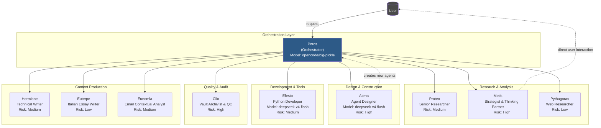
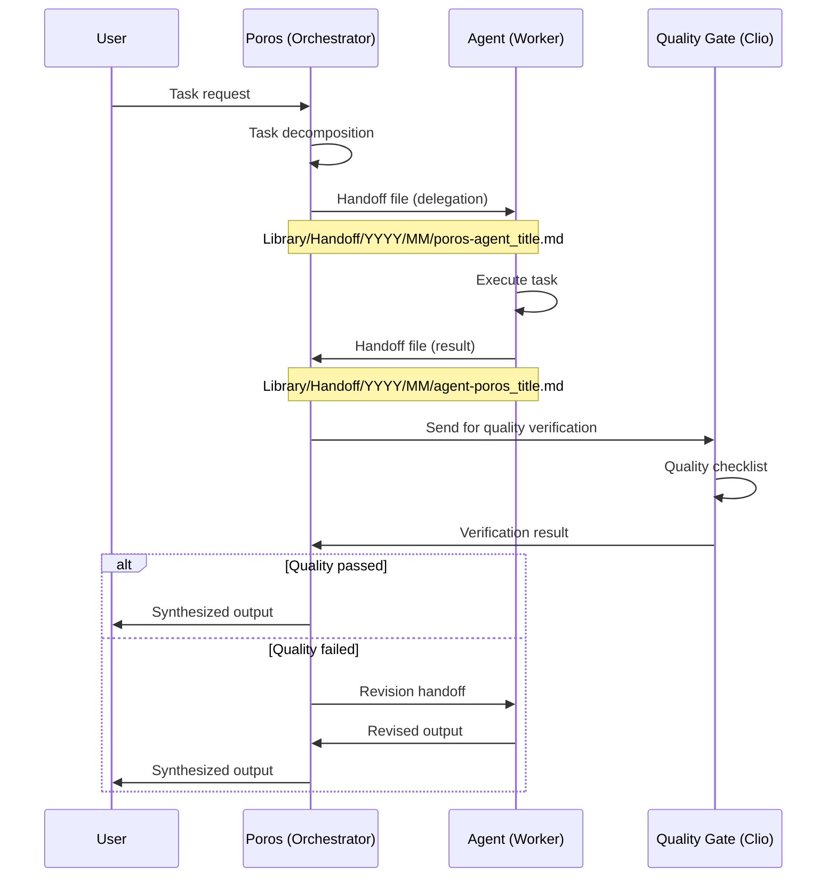
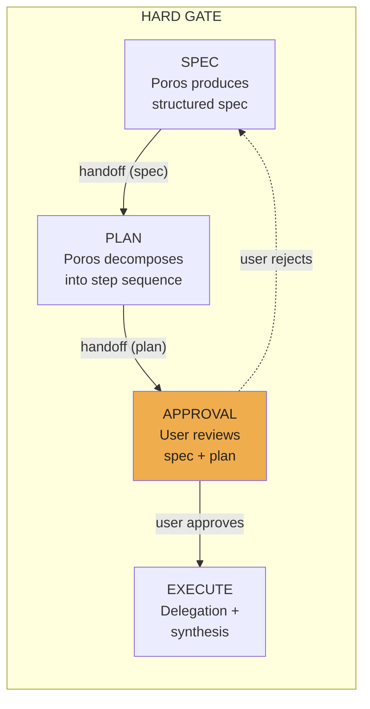
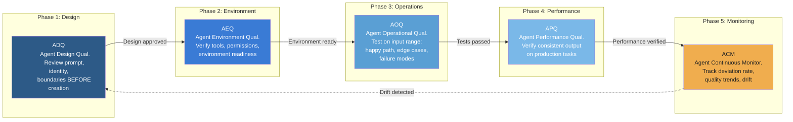
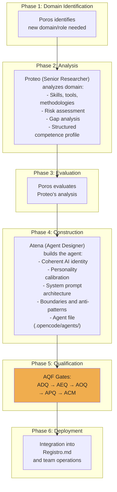

# Team Olimpo: An Agent Qualification Framework for Production-Ready Multi-Agent Systems

## 1. Abstract

The rapid proliferation of multi-agent systems (MAS) has exposed a critical gap: while frameworks for building agent teams abound, no systematic methodology exists for certifying that individual agents operate reliably, consistently, and verifiably over time. This paper presents **Team Olimpo**, a production multi-agent system operating since February 2026, and its primary contribution: the **Agent Qualification Framework (AQF)**, a five-phase quality assurance lifecycle inspired by pharmaceutical validation standards (IQ/OQ/PQ/CPV) and the FDA's Computer Software Assurance (CSA) framework. Unlike existing MAS approaches that treat agents as ephemeral computational units, Team Olimpo introduces a file-based handoff communication system providing complete audit trails, an Agent Factory Pipeline for systematic agent creation, a multi-agent adaptation of the LLM Wiki pattern for knowledge persistence across sessions, and a novel Deliverable Hash System (CRC32) for content-addressable artifact management. The system comprises 10 specialized agents orchestrated by a pure orchestrator (Poros) that never executes tasks directly, operating across two LLM model families (opencode/big-pickle and DeepSeek v4 Flash). Over four months of continuous operation, Team Olimpo has completed 777+ documented handoffs, accumulated 217+ wiki pages across 5 categories, demonstrated 50-90% latency reduction on parallelizable tasks, and achieved a measured 6.7x ROI on knowledge compounding through its wiki layer. The AQF represents, to our knowledge, the first documented framework for structured agent qualification in the MAS literature.

**Keywords:** multi-agent systems, agent qualification framework, LLM wiki, agent factory, quality assurance, orchestrator-workers, knowledge persistence, content-addressable storage

---

## 2. Introduction

The years 2025-2026 have witnessed an explosion of multi-agent system (MAS) frameworks and tools. Projects such as AutoGPT [1], CrewAI [2], LangGraph [3], OpenAI Agents SDK [4], and AutoGen [5] have demonstrated the power of coordinating multiple LLM-powered agents to tackle complex tasks. Yet a fundamental question remains unaddressed: **how do we certify that an agent consistently performs its designated function?**

Current practice in the field reveals four persistent challenges:

1. **Reliability**: There is no standard methodology to validate that an agent's output meets quality thresholds before it is used in production. Agent behavior remains probabilistic, and "it works on my test case" is the prevailing standard of validation.

2. **Traceability**: In most MAS frameworks, inter-agent communication occurs in-memory or through ephemeral message queues. When a task fails, reconstructing the chain of decisions and actions that led to the failure requires replaying the entire execution — if logs exist at all.

3. **Knowledge Persistence**: Agents operate within session-bound context windows. Knowledge acquired in one session is lost at session end, forcing redundant research and repeated context reconstruction. The LLM Wiki pattern proposed by Karpathy [6] addresses this for single-agent systems, but its extension to multi-agent contexts remains unexplored in published literature.

4. **Systematic Agent Creation**: Creating a new specialized agent remains an artisanal process of manual prompt engineering and trial-and-error calibration. No documented pipeline exists for industrializing agent creation with built-in quality gates.

**Contributions.** This paper presents the architecture, methodology, and operational results of Team Olimpo, a production MAS that addresses these challenges. Our specific contributions are:

1. **AQF (Agent Qualification Framework)**: A five-phase qualification lifecycle (ADQ → AEQ → AOQ → APQ → ACM) adapted from pharmaceutical validation standards, providing structured certification of agent reliability with proportional assurance based on operational risk.

2. **File-Based Handoff System**: An asynchronous, file-based inter-agent communication protocol that produces a complete, version-controllable audit trail of every operation, enabling crash recovery and context isolation.

3. **Agent Factory Pipeline**: A systematic, role-separated process (Domain Analysis → Agent Design → Qualification → Deployment) for creating new agents with built-in quality gates.

4. **Multi-Agent LLM Wiki**: An adaptation of Karpathy's single-agent wiki pattern to multi-agent contexts, with multi-author contribution, cross-agent verification, and periodic linting.

5. **Deliverable Hash System (CRC32)**: A content-addressable artifact registry that maps every produced file to an 8-character CRC32 hash, enabling deterministic resolution of deliverables across the system.

6. **IntentGate Routing**: A fixed-category classification system for routing incoming requests to the optimal agent with zero ambiguity, backed by decomposition rules for multi-intent inputs.

The paper is organized as follows. Section 3 describes the overall system architecture, including IntentGate routing, the Deliverable Hash System, and the three workflow types. Section 4 details the handoff communication protocol and the HARD GATE workflow for complex tasks. Section 5, the core contribution, presents the AQF in depth. Sections 6, 7, and 8 cover the Agent Factory Pipeline, Knowledge Persistence, and Multi-Model Orchestration respectively. Section 9 describes the quality assurance system, Section 10 presents operational results, Section 11 surveys related work, and Section 12 concludes with future directions.

---

## 3. System Architecture

Team Olimpo follows a strict **orchestrator-workers** architectural pattern. At its core is **Poros**, a pure orchestrator agent whose sole function is to decompose incoming tasks, delegate them to the most suitable specialized agent, and synthesize the results. Critically, Poros never executes tasks directly — this separation of orchestration from execution is a foundational architectural principle.

### 3.1 Architectural Diagram



### 3.2 Agent Roles and Risk Classification

Each agent in Team Olimpo has a specialized role, assigned LLM model, and AQF risk classification. The risk class determines the depth of qualification required:

| Agent | Role | Model | Risk Class |
|-------|------|-------|------------|
| **Poros** | Pure orchestrator; decomposes, delegates, synthesizes | opencode/big-pickle | High |
| **Proteo** | Senior researcher; domain analysis, comparative studies | opencode/big-pickle | Medium |
| **Atena** | Agent designer; builds new AI team members | openrouter/deepseek/deepseek-v4-flash | High |
| **Efesto** | Python developer; CLI tools, automation, API integration | openrouter/deepseek/deepseek-v4-flash | Medium |
| **Clio** | Vault archivist & QC; PDF conversion, structure validation | opencode/big-pickle | High |
| **Metis** | Thinking partner; strategic analysis, independent reviewer | opencode/big-pickle | High |
| **Pythagoras** | Academic web researcher; scholastic multi-source research | opencode/big-pickle | Low |
| **Hermione** | Technical writer; deep documentation synthesis | opencode/big-pickle | Medium |
| **Euterpe** | Italian essay writer (middle/high school) | opencode/big-pickle | Low |
| **Eunomia** | Email contextual analyst; threading, cross-referencing | opencode/big-pickle | Medium |

### 3.3 Architectural Principles

Three principles govern the architecture:

1. **Separation of Competences**: Each agent has a narrow, well-defined domain with explicit boundaries. No agent's role overlaps with another's. This prevents scope creep, the most common failure mode in agentic systems [7].

2. **Hermetic Isolation**: Each agent operates within its own context window, receiving only task-specific instructions and data. This prevents context rot — the documented degradation of LLM performance as context windows fill [8].

3. **Asynchronous Communication**: All inter-agent communication occurs through the file-based handoff system (Section 4), never through shared memory or direct function calls. This ensures complete traceability and enables crash recovery.

### 3.4 IntentGate Routing

Before any task reaches an agent, it passes through **IntentGate**, a fixed-category routing system embedded in Poros's classification layer. IntentGate classifies every incoming request into exactly one of 17 predefined categories, eliminating creative interpretation at the routing stage.

**Routing categories:**

| Category | Destination | Description |
|----------|-------------|-------------|
| New agent creation | Proteo → Atena | Two-phase: research then build |
| Agent revision | Atena | Modify existing agent profile |
| Professional research | Proteo | Multi-source domain analysis |
| Academic research | Pythagoras | Scholastic multi-source research |
| Technical writing | Hermione | Structured documentation |
| Italian essay | Euterpe | Middle/high school composition |
| Code | Efesto | Python scripts, tools, automation |
| Brainstorming / Strategy | Metis | Strategic analysis, thinking partnership |
| PDF conversion | Clio | Document format transformation |
| OpenCode configuration | (skill customize-opencode) | System-level config changes |
| Vault QC / Audit | Clio | Structure validation, compliance |
| Email vault | Eunomia | Email threading, cross-referencing |
| Simple question / Status | Poros (direct) | Direct response without delegation |
| Session memory / Context | Poros (direct) | Context retrieval and management |
| Task / State / Tracking | Poros (direct) | Task lifecycle operations |
| Ambiguous | — | Clarification requested from user |
| Multi-intent | (decomposed sequence) | Split into ordered sub-tasks |

Multi-intent requests are decomposed into sequential sub-tasks, each routed independently through the IntentGate. This prevents the system from attempting to handle compound requests with a single agent invocation.

### 3.5 Deliverable Hash System (CRC32)

Team Olimpo implements a **content-addressable artifact registry** based on CRC32 hashing. Every file produced by the system — handoffs, wiki pages, documents, deliverables, project files, prompts — is registered with a deterministic 8-character hex hash.

**Resolution protocol via `synapsis_d_get`:**:
- **Level 1 (l=1)**: Returns metadata only — file path, timestamp, size
- **Level 2 (l=2)**: Returns approximately 500-character summary of content
- **Level 3 (l=3)**: Returns full file content

Registration occurs via `synapsis_d_set(p=...)`, which accepts a file path and returns its CRC32 hash. This system serves three purposes:

1. **Deterministic referencing**: Any artifact can be referenced by its hash, independent of file system location or renaming.
2. **Integrity verification**: Hash collisions are detectable; a mismatched hash indicates content alteration.
3. **Cross-session persistence**: Handoffs and deliverables from previous sessions are resolvable by hash alone, without path reconstruction.

The hash system is layered atop the existing file-based storage: the canonical file path remains the source of truth, and the hash provides a content-addressable index. As of June 2026, over 2,000 files have been registered in the deliverable hash system.

### 3.6 Workflow Types

Team Olimpo defines three operational workflows, selected by Poros based on task complexity:

**Flow 1 — Simple (Direct Response):** For status inquiries, simple questions, or context retrieval. Classification → direct response. Maximum 1 tool call. No delegation.

**Flow 2 — Single Worker Delegation:** For tasks requiring a single specialized agent. Create task → launch worker → read handoff → synthesize. Maximum 3 tool calls. Suitable for research queries, document writing, code generation, and similar single-domain tasks.

**Flow 3 — HARD GATE (Complex Multi-Step):** For tasks spanning multiple domains, requiring ≥3 steps or involving more than one worker agent. Follows a structured sequence: **Spec** → **Plan** → [User Approval] → **Execute**. Each stage produces a handoff. Execution blocks until explicit user approval of the plan. Detailed in Section 4.4.

---

## 4. The Handoff System

Inter-agent communication in Team Olimpo is mediated exclusively through a **file-based handoff protocol**. Instead of in-memory message passing or shared state, every delegation, result, and notification is persisted as a structured Markdown file.

### 4.1 Handoff Structure

Handoff files follow a strict naming convention and contain YAML frontmatter:

**Path:** `Library/Handoff/YYYY/MM/data_mittente-destinatario_titolo.md`

**Frontmatter fields:**
- `date`: ISO date of creation
- `mittente`: sender agent name
- `destinatario`: recipient agent name  
- `tipo`: one of `report`, `profilo`, `analisi`, `ricerca`, `nota`, `specifica`, `audit`
- `stato`: `in-esecuzione`, `completato`, `bloccato`, `da-processare`
- `priorita`: `alta`, `media`, `bassa`
- `quality_score`: 1-5 rating (AQF field)
- `verifica_esterna`: boolean, whether verified by a different agent

### 4.2 Handoff Flow



### 4.3 Advantages of File-Based Communication

The file-based approach provides several advantages over in-memory communication typical of other MAS frameworks:

| Aspect | In-Memory (CrewAI, LangGraph) | File-Based (Team Olimpo) |
|--------|-------------------------------|--------------------------|
| **Audit Trail** | Ephemeral; lost after execution | Permanent; all decisions persisted |
| **Crash Recovery** | State lost; must restart | State recoverable from last handoff |
| **Context Isolation** | Shared context window; context rot risk | Per-agent context isolation |
| **Parallelism** | Limited by shared state | Independent tasks run in parallel |
| **Version Control** | Not applicable | Git-versionable |
| **Debugging** | Requires execution replay | Direct file inspection |

As of June 2026, Team Olimpo has produced **777+ handoff files** across all agents, with an average completion time of approximately 5 minutes per handoff task. The handoff protocol has proven robust across four months of continuous operation, surviving session interruptions, model switches, and concurrent task execution.

### 4.4 HARD GATE Workflow for Complex Tasks

For multi-step tasks spanning multiple agents or requiring more than three steps, Team Olimpo employs the **HARD GATE** workflow. This is a structured, approval-gated process that prevents resource waste on misunderstood or misaligned complex tasks.

**The HARD GATE sequence:**



**Step 1 — Spec (Specification):** Poros produces a structured specification document describing the task scope, required agents, expected outputs, and success criteria. This is written as a handoff file.

**Step 2 — Plan (Execution Plan):** Poros decomposes the spec into a sequential execution plan with explicit agent assignments, dependencies, and estimated step count. The plan is also written as a handoff file.

**Step 3 — Approval:** Both spec and plan are presented to the user for review. Execution blocks until the user explicitly approves. If the user rejects or requests changes, Poros revises the spec and plan accordingly.

**Step 4 — Execute:** Upon approval, Poros delegates each step to the appropriate agents using the standard handoff protocol, then synthesizes results.

The HARD GATE ensures that complex, multi-step tasks receive proportional planning effort before execution begins, reducing the risk of costly rework.

---

## 5. AQF — Agent Qualification Framework

The **Agent Qualification Framework (AQF)** is the central contribution of this paper. It provides a structured, risk-based methodology for certifying that AI agents perform their designated functions reliably, consistently, and verifiably over time.

### 5.1 Inspiration and Context

The AQF draws direct inspiration from pharmaceutical validation standards and the FDA's Computer Software Assurance (CSA) framework:

- **IQ/OQ/PQ**: Installation Qualification, Operational Qualification, Performance Qualification — the cornerstone of equipment validation in GMP (Good Manufacturing Practice) environments, codified in FDA 21 CFR Part 11 [9] and GAMP 5 [10].
- **CPV**: Continued Process Verification, the ongoing monitoring phase introduced in FDA's 2011 Process Validation guidance [11].
- **CSA**: Computer Software Assurance (FDA, 2024) [12], which introduced risk-based assurance levels and replaced the more rigid "validation" requirement for certain software systems.

The key insight is that AI agents, like pharmaceutical manufacturing equipment, require evidence that they consistently produce correct outputs — and that when they deviate, the deviation is detected, documented, and addressed.

### 5.2 The Five Phases



#### Phase 1: ADQ — Agent Design Qualification

Before any agent is created, its design undergoes structured review. This phase prevents the most costly errors: agents with poorly defined identities, contradictory instructions, or missing boundaries.

**Checklist items:**
- Clear role definition (single domain, no overlap)
- Explicit boundaries ("what not to do" section)
- Appropriate LLM model selection for the domain
- Tool permissions aligned with role
- Risk classification assigned (High/Medium/Low)
- Frontmatter YAML valid and complete

#### Phase 2: AEQ — Agent Environment Qualification

Verifies that the execution environment is ready before the agent runs its first task:

- Required tools are installed and accessible
- File permissions are correctly configured
- Dependent agents are operational
- Context window allocation is appropriate

#### Phase 3: AOQ — Agent Operational Qualification

The agent is tested on a representative range of inputs to verify correct operation:

- **Happy path**: Standard task — does the agent produce correct output?
- **Edge cases**: Boundary conditions — does the agent handle unusual but valid inputs?
- **Failure modes**: Missing data, tool errors — does the agent fail gracefully?

AOQ pass rates are tracked per risk class:

| Risk Class | Minimum AOQ Pass Rate | Required Test Cases |
|------------|----------------------|-------------------|
| High | ≥90% | 10 tests (4 happy, 3 edge, 3 failure) |
| Medium | ≥80% | 6 tests (3 happy, 2 edge, 1 failure) |
| Low | ≥70% | 4 tests (2 happy, 1 edge, 1 failure) |

#### Phase 4: APQ — Agent Performance Qualification

The agent operates on real production tasks under observation. Output quality is measured via a **composite quality score**:

| Dimension | Weight | Measure |
|-----------|--------|---------|
| Completeness | 30% | All required elements present |
| Accuracy | 40% | Factual correctness vs. source |
| Conformance | 20% | Adherence to format conventions |
| Efficiency | 10% | Token usage vs. expected range |

The composite score is calculated as:

```
Q_score = 0.30 × completeness + 0.40 × accuracy + 0.20 × conformance + 0.10 × efficiency
```

An agent passes APQ if its composite score exceeds the threshold for its risk class (High: ≥0.85, Medium: ≥0.75, Low: ≥0.65).

#### Phase 5: ACM — Agent Continuous Monitoring

The agent enters continuous monitoring for its operational lifetime. This phase addresses a problem unique to AI agents: **model drift**. The LLM underlying an agent may be updated, its prompt may be modified, or external tools may change — any of which can silently degrade performance.

**Monitoring metrics:**
- **Deviation rate**: Percentage of tasks where output falls below quality thresholds
- **Quality trend**: Moving average of composite quality scores over 20-task windows
- **Drift detection**: Statistical comparison of current performance vs. APQ baseline

**Alert thresholds:**
- Deviation rate > 20%: Poros receives notification
- Deviation rate > 40%: Agent is suspended pending requalification

### 5.3 Risk-Based Assurance (CSA Principle)

Following the CSA framework [12], the assurance level is proportional to operational risk:

| Risk Class | Criteria | AQF Requirements |
|------------|----------|------------------|
| **High** | Direct impact on user-facing output, orchestration, critical data | Full ADQ + AEQ + AOQ + APQ + ACM |
| **Medium** | Impact on internal quality, indirect user impact | Essential ADQ + AOQ + ACM |
| **Low** | Well-bounded content production, narrow domain | Minimal ADQ + lightweight ACM |

### 5.4 Deviation Log

Every quality deviation is documented in a structured deviation log with YAML frontmatter:

```yaml
date: 2026-05-16
member: euterpe
deviation_type: frontmatter_error
description: "Outdated frontmatter fields (tools: instead of permission:, name: instead of nome:)"
root_cause: "Atena instructions not updated; no verification step"
corrective_action: "Manual frontmatter correction; template update triggered"
outcome: resolved
```

### 5.5 Concrete Example: Qualifying Eunomia

Eunomia, an agent for email contextual analysis and contact management created on 2026-05-13, provides an illustrative qualification case:

1. **ADQ**: Design reviewed by Atena — role defined as email analysis specialist, model assigned (originally sonnet based on text classification strengths, later migrated to opencode/big-pickle during system consolidation), risk class set to Medium (indirect user impact).

2. **AEQ**: Environment verified — dependency on email threading pipeline (developed by Efesto), fallback manual analysis defined, write permissions to person records confirmed.

3. **AOQ**: Tested on 6 cases — 3 standard email formats, 2 edge cases (multilingual, attachments), 1 failure mode (malformed email). Pass rate: 5/6 (83%).

4. **APQ**: Composite score of 0.78 over 10 production tasks (completeness: 0.85, accuracy: 0.82, conformance: 0.70, efficiency: 0.65).

5. **ACM**: Entered monitoring with 20-task moving average quality score baseline.

---

## 6. Agent Factory Pipeline

Team Olimpo has industrialised the process of creating new AI agents through a documented, repeatable pipeline with separation of analytical from construction roles.

### 6.1 Pipeline Flow



### 6.2 Role Separation

A critical design principle is the strict separation between **who analyzes the domain** (Proteo) and **who builds the agent** (Atena):

- **Proteo**: Domain analysis, competence profiling, risk assessment — a research function
- **Atena**: Agent design, personality engineering, prompt architecture — a construction function

This separation prevents bias (the analyst does not become attached to their design) and ensures each phase is performed by a specialist.

### 6.3 Results

Using this pipeline, Team Olimpo has created **10 agents** in approximately four months, with an average creation cycle of 2-3 days per agent. The pipeline has produced agents across diverse domains: research (Proteo), development (Efesto), creative writing (Euterpe), technical documentation (Hermione), and email analysis (Eunomia).

---

## 7. Knowledge Persistence: Multi-Agent LLM Wiki

The **knowledge persistence problem** in MAS is well-documented: agents operate within session-bounded context windows, and knowledge acquired in one session is lost at session end. Team Olimpo addresses this through a multi-agent adaptation of the LLM Wiki pattern proposed by Karpathy [6].

### 7.1 Wiki Structure

```
Library/Wiki/
├── index.md              # Semantic index (concise, navigable)
├── log.md                # Append-only chronological operation log
├── concepts/YYYY/MM/     # Persistent conceptual knowledge
├── decisions/YYYY/MM/    # Architectural decision records
├── research/YYYY/MM/     # Completed research syntheses
├── references/           # External reference collection
└── projects/             # Project-specific knowledge
```

### 7.2 Multi-Agent vs. Single-Agent Adaptation

The key differences from Karpathy's original single-agent pattern are:

| Dimension | Single-Agent (Karpathy) | Multi-Agent (Team Olimpo) |
|-----------|------------------------|---------------------------|
| **Authorship** | Single LLM | Poros orchestrates, multiple agents contribute by competence |
| **Readership** | Single LLM | Each agent reads according to its competence |
| **Audit Trail** | None | Every wiki operation traced via handoff system |
| **Quality** | Unverified (LLM alone) | Clio verifies format, multiple agents cross-check content |
| **Error Correction** | Undetected hallucinations | Cross-agent verification; one agent corrects another's error |
| **Persistence** | Session-based context file | Structured wiki with index and log |

### 7.3 hot.md: Context Cache

Complementing the wiki, `Team/Meta/hot.md` serves as an ultra-lightweight (~400 tokens) context cache that maintains current team state across sessions:

- Current project and active tasks
- Recent decisions (with date and status)
- Last 5 chronological operations
- Open questions requiring attention
- Quick links to relevant wiki pages

### 7.4 Measured ROI

The wiki layer's return on investment was rigorously calculated over a 30-day measurement period [13]:

| Metric | Value |
|--------|-------|
| Setup cost (one-time) | ~2,090 tokens |
| Monthly maintenance cost | ~8,400 tokens |
| Monthly benefit (token savings) | ~70,440 tokens |
| **ROI (first month)** | **6.7x** |
| **ROI (steady state)** | **8.4x** |
| hot.md ROI | **9.6x** (19,200 tokens saved / 2,000 invested) |

Primary savings sources:
- Redundant research avoided (~30% on previously covered topics)
- Reduced context reconstruction time (~5,384 tokens → ~500 tokens per lookup)
- Accelerated new member onboarding (~40% faster)

As of June 2026, the wiki contains **217+ pages** across **5 categories** (concepts, decisions, research, references, projects).

---

## 8. Multi-Model Orchestration

Unlike most MAS frameworks that assume a uniform LLM across all agents [2][3][4], Team Olimpo natively integrates multiple models, routing tasks based on domain requirements:

| Model | Agents | Rationale |
|-------|--------|-----------|
| **opencode/big-pickle** | Poros, Proteo, Clio, Metis, Pythagoras, Hermione, Euterpe, Eunomia | General-purpose orchestration and execution |
| **openrouter/deepseek/deepseek-v4-flash** | Atena, Efesto | Optimized for agent design and code generation tasks |

This multi-model architecture provides three key benefits:

1. **Task-Optimized Routing**: Each agent uses the model best suited to its domain — no single model must perform well across all tasks.

2. **No Vendor Lock-In**: The system can add or replace models without architectural changes. New model integrations require only updating the target agent's configuration.

3. **Empirical Model Selection**: Model assignments are driven by observed performance on specific task types, not by provider preference. Atena and Efesto were assigned to DeepSeek v4 Flash after comparative testing showed superior results for structured agent design and code generation respectively.

---

## 9. Quality Assurance

Quality assurance in Team Olimpo operates at multiple levels, providing layered protection against output degradation.

### 9.1 Quality Layers

1. **Poros** (orchestrator-level): Applies a 6-point quick checklist before accepting any agent's output: (i) format compliance, (ii) factual consistency, (iii) source attribution, (iv) completion of all required sections, (v) appropriate citations, (vi) no hallucinated content.

2. **Clio** (documentation gate): Specialized quality gate for Obsidian vault compliance — verifies frontmatter YAML, wikilinks, image paths, naming conventions, and structural adherence to vault standards. Also handles PDF conversion pipeline quality and structure validation audits.

3. **ACM** (continuous monitoring): The AQF's Phase 5 provides longitudinal quality tracking with automated deviation logging and threshold-based alerting.

### 9.2 Quality Metrics

| Metric | Calculation | Threshold | Action |
|--------|-------------|-----------|--------|
| **Deviation Rate** | Deviations / Total tasks (rolling 20) | >20% → notify; >40% → suspend | Poros notification / agent suspension |
| **Quality Score** | Composite: 30% completeness + 40% accuracy + 20% conformance + 10% efficiency | ≥0.85 (High risk) | Pass/fail per risk class |
| **OQ Pass Rate** | Tests passed / Total tests | ≥90% (High), ≥80% (Medium), ≥70% (Low) | Qualification gate |

### 9.3 Deviation Log Schema

```yaml
date: "ISO date"
member: "agent name"
deviation_type: "error | quality_drop | boundary_violation | format_error"
description: "free text"
root_cause: "identified cause"
corrective_action: "taken or planned"
outcome: "resolved | in_progress | escalated | won_t_fix"
```

---

## 10. Operational Results

Team Olimpo has been in continuous operation since February 2026. As of June 2026, the following metrics have been recorded:

### 10.1 Summary Metrics

| Metric | Value |
|--------|-------|
| Active agents | 10 |
| Completed handoffs | 777+ |
| Months of operation | 4+ (Feb–Jun 2026) |
| LLM models in use | 2 families (opencode/big-pickle, deepseek-v4-flash) |
| Wiki pages created | 217+ |
| Wiki categories | 5 (concepts, decisions, research, references, projects) |
| Public repository commits | 12+ |
| GitHub issues referenced | ~11012 (OpenCode subagent limitation) |

### 10.2 Task Categories Completed

Team Olimpo has successfully executed tasks across diverse domains:

- **Business Planning**: Competitor analysis, market research, cost-benefit analysis
- **Research Synthesis**: AI agent architecture comparison, IQ/OQ/PQ regulatory research
- **Technical Development**: CLI tool development (Typer-based), PDF conversion pipeline
- **Documentation**: Deep-dive technical whitepapers, wiki implementation, compliance audits
- **Communication**: Email contextual analysis, threading, cross-referencing
- **Content Creation**: Italian school essays (Euterpe), technical reports (Hermione)
- **Agent Design**: Full pipeline agent creation (Proteo → Atena), agent revision cycles
- **Strategic Analysis**: Brainstorming, option mapping, independent review (Metis)

### 10.3 Parallelism Performance

The system's ability to execute independent subtasks in parallel — governed by a 4-criteria filter (no data dependency, no shared exclusive resources, independent execution possible, post-hoc synthesis feasible) — has demonstrated **50-90% latency reduction** on multi-subtask operations compared to sequential execution [14].

### 10.4 Case Examples

**Case 1 — Agent Architecture Research (2026-05-01)**: Poros delegated a comparative analysis of single-agent vs. multi-agent architectures to Proteo. The resulting 81-line report synthesized findings from 9 sources (Anthropic, OpenAI, Azure, arXiv, LangChain) and delivered a structured recommendation within one session. The report was subsequently wiki-ized into a persistent concept page.

**Case 2 — AQF Implementation (2026-05-16)**: A coordinated effort involving Metis (strategic analysis of qualification frameworks), Clio (audit of existing processes and quality gaps), and Atena (risk classification and ADQ checklist creation). The AQF was designed, documented, and partially deployed in a single day across all 10 agents.

**Case 3 — Email Integration Pipeline**: Eunomia (contextual analyst) was created via the Agent Factory Pipeline, qualified through AQF gates, and deployed to process email inbox data into structured records, with a fallback to manual analysis when automated threading is unavailable.

---

## 11. Related Work

### 11.1 Multi-Agent Frameworks

Several frameworks have advanced the state of the art in MAS:

**AutoGPT** [1] pioneered autonomous agent loops but lacks structured inter-agent communication. **CrewAI** [2] introduced role-based agents with shared tools, though communication remains in-memory. **LangGraph** [3] provides stateful graph-based execution with checkpointing, but traceability is execution-level rather than document-level. **OpenAI Agents SDK** [4] offers handoff between specialized agents but with no persistent audit trail. **AutoGen** [5] from Microsoft provides conversational agent patterns but similarly lacks structured qualification.

The **AgentOrchestra** benchmark [15] (arXiv 2506.12508) provides empirical evidence that hierarchical multi-agent systems outperform single-agent approaches by 30% on GAIA benchmarks, supporting Team Olimpo's architectural choice.

### 11.2 LLM Wiki Pattern

Karpathy's LLM Wiki pattern [6] proposed a file-based knowledge layer for single-agent Claude Code sessions. Team Olimpo's contribution is the adaptation to multi-agent contexts, demonstrating that the pattern scales to multi-author, multi-reader environments with added quality verification. Our measured ROI of 6.7x provides the first published cost-benefit analysis of the pattern.

### 11.3 Pharmaceutical Validation Standards

The IQ/OQ/PQ framework originates from FDA's 21 CFR Part 11 [9] and ISPE's GAMP 5 [10]. The FDA's 2024 Computer Software Assurance guidance [12] updated this approach with risk-based assurance levels — the direct inspiration for AQF's proportional qualification. To our knowledge, Team Olimpo is the first documented application of these pharmaceutical validation concepts to AI agent qualification.

### 11.4 Quality in Agent Systems

Anthropic's research on multi-agent reliability [16] and OpenAI's practical guide to building agents [4] address quality at the design level but do not propose structured qualification frameworks. The MAS literature lacks standardized metrics for agent output quality, a gap that AQF's composite quality score begins to address.

---

## 12. Conclusion and Future Work

Team Olimpo demonstrates that **reliability, traceability, and quality assurance are achievable in production multi-agent systems** through architectural discipline and structured qualification. Our key findings are:

1. **The AQF provides a viable framework** for certifying agent reliability through five graduated phases, from design review through continuous monitoring.

2. **File-based handoff communication** enables complete audit trails, crash recovery, and context isolation — capabilities absent from in-memory MAS architectures.

3. **Systematic agent creation** through the Agent Factory Pipeline reduces the time-to-agent from weeks of trial-and-error to days of structured process.

4. **Knowledge compounding** through the multi-agent LLM Wiki achieves measurable ROI (6.7x), validating knowledge persistence as a cost-effective investment.

5. **Multi-model orchestration** is practical and beneficial, allowing task-optimized model selection without architectural complexity.

6. **IntentGate routing** and the **Deliverable Hash System** provide unambiguous task routing and content-addressable artifact management, two capabilities previously absent from the MAS toolkit.

### 12.1 Future Work

Several directions for future research and development are planned:

1. **AQF Automation**: Translating AQF checklists into executable code — automated AOQ test suites, real-time quality score calculation, and drift detection via statistical process control charts.

2. **CI/CD Integration**: Embedding AQF gates into GitHub Actions for automated qualification on agent profile changes.

3. **Open Standard Development**: Publishing the AQF specification as an open standard on arXiv and inviting external contributions through the `teamolimpo-paper` repository.

4. **Model Expansion**: Integrating additional LLM providers (Gemini, Mistral, Claude) and developing a formal model-to-task routing framework.

5. **AQF Follow-Up Paper**: A dedicated paper providing the complete AQF specification, including detailed phase protocols, test case templates, and quality score calculation methodology.

---

## Acknowledgments

Team Olimpo operates within the OpenCode ecosystem and acknowledges the foundational work of Andrej Karpathy (LLM Wiki pattern), the FDA and ISPE (validation frameworks), and the broader multi-agent systems research community.

---

## References

[1] Significant Gravitas. "AutoGPT." GitHub, 2023. https://github.com/Significant-Gravitas/AutoGPT

[2] CrewAI. "CrewAI: Framework for Orchestrating Role-Playing AI Agents." 2025. https://github.com/crewAIInc/crewAI

[3] LangChain. "LangGraph: Building Stateful Multi-Agent Applications." 2026. https://blog.langchain.com/building-multi-agent-applications-with-deep-agents

[4] OpenAI. "A Practical Guide to Building Agents." 2026. https://openai.com/business/guides-and-resources/a-practical-guide-to-building-ai-agents

[5] Microsoft Research. "AutoGen: Enabling Next-Gen LLM Applications via Multi-Agent Conversation." arXiv:2308.08155, 2023.

[6] Karpathy, A. "LLM Wiki Pattern." 2025. https://github.com/karpathy/LLM-Wiki

[7] OpenAI. "Prompt Engineering Best Practices." 2025. https://platform.openai.com/docs/guides/prompt-engineering

[8] LangChain. "Context Rot in LLM Applications." 2025. https://blog.langchain.com/context-rot-in-llm-applications

[9] FDA. "21 CFR Part 11: Electronic Records; Electronic Signatures." 2022. https://www.accessdata.fda.gov/scripts/cdrh/cfdocs/cfcfr/CFRSearch.cfm?CFRPart=11

[10] ISPE. "GAMP 5: A Risk-Based Approach to Compliant GxP Computerized Systems." Second Edition, 2022.

[11] FDA. "Guidance for Industry: Process Validation — General Principles and Practices." 2011.

[12] FDA. "Computer Software Assurance for Production and Quality System Software." 2024. https://www.fda.gov/regulatory-information/search-fda-guidance-documents/computer-software-assurance-production-and-quality-system-software

[13] Team Olimpo, Metis. "Analisi Costi-Benefici: 5 Miglioramenti LLM Wiki per Team Olimpo." Internal Report, 2026-05-11.

[14] Anthropic Engineering. "Multi-Agent Research System." 2026. https://www.anthropic.com/engineering/multi-agent-research-system

[15] AgentOrchestra. "AgentOrchestra: A Multi-Agent Orchestration Framework." arXiv:2506.12508v3, 2026.

[16] Anthropic. "Building Effective Agents." 2025. https://docs.anthropic.com/en/docs/build-with-claude/agent-patterns

[17] Arun Baby. "Role-Based Agent Design." 2026. https://arunbaby.com/ai-agents/0031-role-based-agent-design/

[18] Microsoft Azure. "Single-Agent vs Multi-Agent Systems." 2025. https://learn.microsoft.com/en-us/azure/cloud-adoption-framework/ai-agents/single-agent-multiple-agents

[19] OpenCode. "AI Agents — Autonomous Coding." 2026. https://open-code.ai/docs/en/agents

[20] GitHub. "Issue #11012: SubAgents are enclosed, prohibiting genuine task management." 2026. https://github.com/anomalyco/opencode/issues/11012

---

*This whitepaper is produced by Team Olimpo — a multi-agent system designed, built, and operated by its own members. For the latest version, see the `teamolimpo-paper` repository.*
